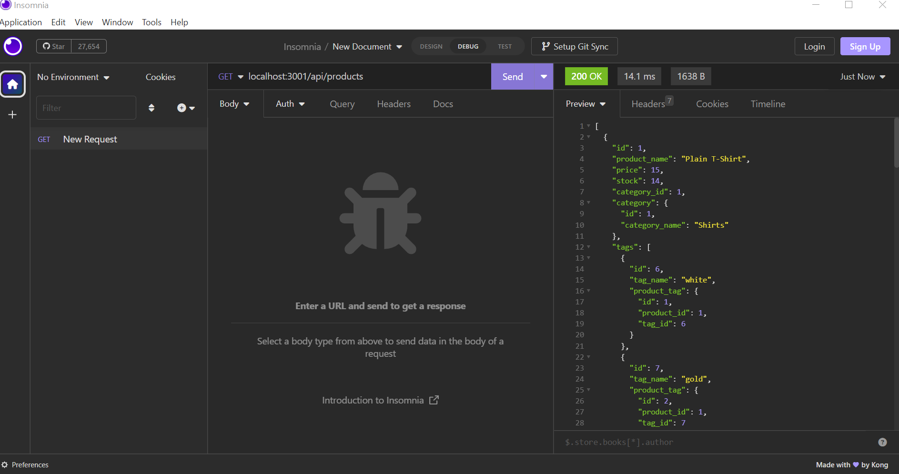
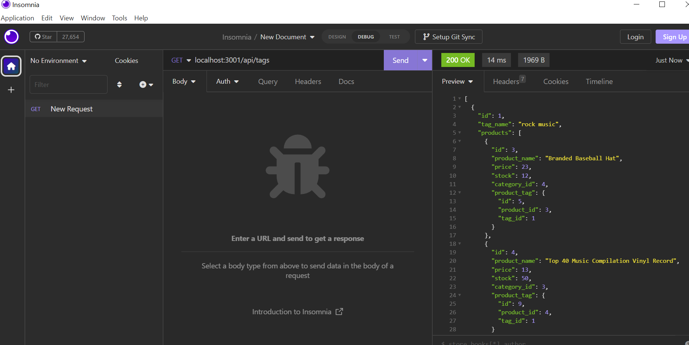

## ELL E-commerce Back End

## Description

I wanted to build this e-commerce site for users to utilize. The goal was to implement what I have learned regarding mySQL, Sequelize, APIs to creat this site. 

## Installation

npm i;
mysql -u root -p;
npm run start

## Usage

The [repo](https://github.com/elizabeth189/myPWA-ELL/blob/main/README.md) allows you to view the files!
You can look through the files to check out e-commerce site.!

For example, in insomnia you can GET: 
-localhost:3001/api/tags
-localhost:3001/api/products
 
 

## License

Please refer to the LICENSE in the repo.

## Credits

Class assignments and lessons related to this module were used when building this project, along with outside resources such as:
-StackOverflow
-W3Schools
-Mozilla
-ChatGPT (great at explaining errors!)

## Questions

Please feel free to reach out with any questions by email or connect through [LinkedIn](https://www.linkedin.com/in/elizabeth-lopez-lopez-345b3b14a/)

## Video
coming soon!